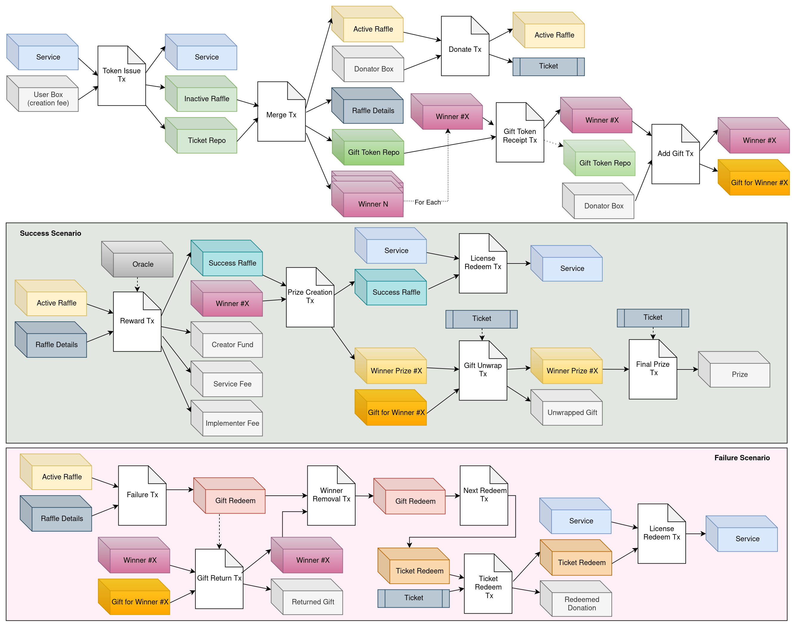
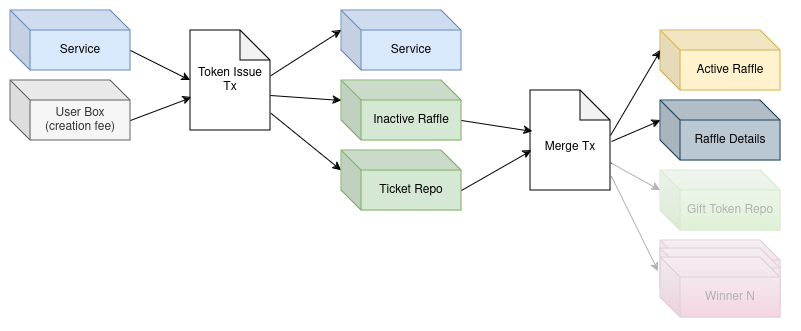
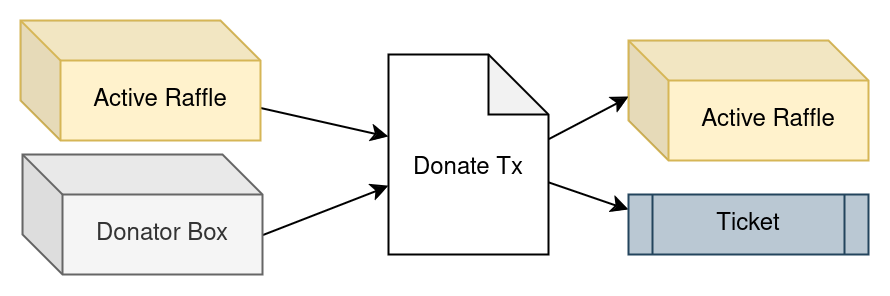
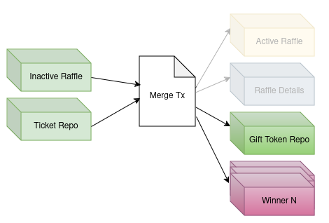
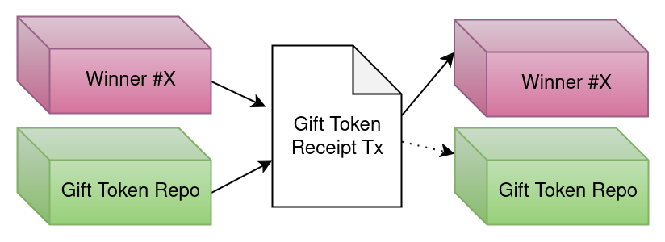

# contracts

This package contains ErgoRaffle V2 ErgoScript contracts, alongside unit tests for each contract that cover all scenarios.

## Table of contents

- [Introduction](#introduction)
- [Components](#components)
- [Life Cycle](#life-cycle)
- [Installation](#installation)

## Introduction

ErgoRaffle is a crowdfunding service that aims to enable anyone to raise enough money needed for a project. The project can be a direct donation to a charity, an academic or business plan, or anything else the creator can convince people to part with their hard-earned ERG for.

As a bonus, after finishing the raffle, a lottery takes place, and a lucky participant wins the raffle reward. Each raffle has a deadline and raising goal, if the raffle reaches its goal within the deadline the raffle is successful and the project, winner, and service will charge accordingly. Otherwise, the raffle is unsuccessful, and it will pay back all collected funds to the raffle participants. If the raffle achieves its goal before the deadline it will continue operating till the deadline and it can be overfunded.

In the following, we will present the ErgoRaffle V2 procedure in different steps.

<p align="center">

</p>

## Components

Before explaining the main idea and procedure of the raffle, it's better to get familiar with its components:

### Tokens

1. **Service NFT:** We distinguish the raffle service box with its unique identifier in the network. The service box contains all system configurations and it's a piece of sensitive information.
2. **Raffle License:** Every valid raffle created by our service needs to stand out from other boxes with the same contract, so we use a Raffle License token for all raffles made by our service. At the beginning, the raffle service box contains all License tokens, and the service uses these tokens to create valid raffles. All raffles will return the license token after they finish.
3. **Ticket:** Each raffle raises funds by selling tickets. So, each raffle has its own Ticket token created at its start. This token also marks certain special boxes related to each raffle. The Ticket token will be burned after the raffle ends.
4. **Gift Token:** Raffle winners get a share of collected funds, as their reward. This share is fixed and set by the raffle creator. Also, anyone can add gifts for raffle winners after it's created. Each gift box made for a raffle is identified by the gift token of that raffle. The gift token is created after the raffle starts and is unique for each raffle.
5. **Collecting Token:** Raffles can raise funds for projects with ERG or any desired token. If the raffle's goal is based on a token instead of ERG, we call it a token-goal raffle and use the term Collecting Token for its token.
6. **Owner NFT:** The service owner holding this NFT can adjust service configuration anytime.
7. **Ticket Collector NFT:** The service owner can collect old unused tickets with this NFT.

### Contracts

1. **Service:** The box with this contract contains all service information, and it's responsible for creating legitimate raffles with the Raffle License Token. It has a unique box and it's distinguishable in the network with the Service NFT.
2. **Inactive Raffle:** Raffle creation has two steps. At first, we have an inactive raffle without tickets. This contract verifies the creation of the new active raffle.
3. **Ticket Repo:** The ticket tokens are minted in the box with this contract. By merging the ticket repo with the prior box, we can activate the raffle.
4. **Active Raffle:** Active raffle is responsible for raising funds by selling ticket tokens. All raised funds are locked in the Active raffle box until reaching its deadline.
5. **Ticket:** Participants will donate to each raffle by buying their tickets. Each ticket has some raffle ticket tokens that show the ticket's worth.
6. **Winner:** This box specifies each winner's share and is responsible for creating and tracking the winner's gifts.
7. **Gift Token Repo:** Holds gift tokens and sends the tokens to winner boxes after the raffle starts.
8. **Gift:** Anyone can create a gift box to incentivize others' participation. The gift will be returned to the donator in case of a failed raffle.
9. **Success Raffle:** If the raffle reaches its goal, the Success Raffle is created. This box is responsible for reward distribution with specified shares.
10. **Winner Prize:** This box contains one winner's prize share and the winner's ticket number. It also unwraps gift boxes belonging to that winner.
11. **Gift Redeem:** In case of an unsuccessful
12. **Ticket Redeem:** If the raffle can not achieve its goal within the deadline, the raised money is sent to this contract to refund the participants.
13. **Raffle detail:** Raffle information including name, description and picture links is stored in this box.

## Life Cycle

Each raffle has a deterministic life cycle and passes through different stages based on its status.
The raffle life cycle has four main phases: creation, donation, successful raffle withdrawal, and refund.
Besides, we have a separate life cycle for winners' rewards to distribute the raffle reward between winners and receive their gifts. Although these procedures are correlated we will review them separately.

### Phase 1: Raffle Creation

To start a new raffle, the raffle creator needs to set some parameters like creator and winner percentage, creator address, deadline, goal, and ticket price. Then they must pay the raffle creation fee to create the active raffle box. The creation process happens in two steps:

1. **Token Issue**: Each raffle has a set of unique tokens. In this step, the service box mints the raffle Ticket tokens, and at the same time, an inactive raffle is created containing the valid License NFT. This step has two outputs: the Ticket Repo box and the Inactive Raffle box.

2. **Merge**: The outputs from the previous step merge to create the Active Raffle box and a box containing the raffle's information. The purpose of the Raffle Detail box is to reduce redundant information in the network.

<p align="center">

</p>

### Phase 2: Raffle Donation

TBD

<p align="center">

</p>

### Phase 3: Successful Raffle

TBD

### Phase 4: Refunding

TBD

### Phase I: Winner Creation

When creating a new raffle, the creator can specify the number of winners, and the service will generate the necessary boxes. To ensure their uniqueness in the network, each winner box has one raffle ticket token. Additionally, to add and track the created gifts (i.e., winner rewards added after the raffle creation), each winner box should have some gift tokens. These tokens are minted in a separate box at the beginning and then transferred to the winner boxes.

<p align="center">

</p>

The winner boxes are activated after they receive their gift tokens.

<p align="center">

</p>

### Phase II: New Gifts

TBD

### Phase III: Gift Unwrap (Successful Raffle)

TBD

### Phase IV: Gift Return (Failed Raffle)

TBD

## Installation

npm:

```sh
npm i contracts
```

yarn:

```sh
yarn add contracts
```
